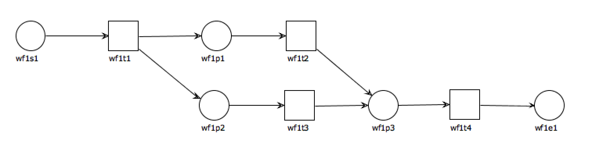

# Exemple

## Les places

* wf1s1 : La place de démarrage du workflow. Elle réagit à l'événement "LOT.VALIDATED"
* wf1e1 : La place de fin du workflow

## Les transitions (souscriptions)

* wf1t1 : C'est une transition automatique qui ne fait rien de spécial.
* wf1t2 : Elle est automatique, c'est une fonction qui effectue une temporisation de 100s. La barre de progression est mise à jour toutes les 10s.
* wf1t3 : Cette transition attend une action de l'utilisateur pour continuer (liée à un événement)
* wf1t4 : La "vrai" fonction.

## Explication

En fait ce workflow permet de déclencher en automatique un traitement au bout de 100s, ou si un utilisateur le demande avant via une action spécifique.

## Bdd

En base on trouvera donc :
* 1 Workflow
* 5 places
* 4 souscriptions
* 9 arcs
* 2 événements (wf1s1 & wf1t3)
* 2 fonctions (wf1t2 & wf1t4)

## Exemple d'avancement.

On déclenche l'événement "LOT.VALIDATED" pour le lot 1, thème LOTFACT. Ceci va démarrer le cas et poser un jeton libre en wf1s1.

wf1t1 est une transition automatique, qui va consommer le jeton wf1s1, et poser deux jetons libres, un en wf1p1 et un en wf1p2. La transition wf1t2 démarre et attend 100s.

Au bout de 100s le jeton wf1p1 est consommé et un jeton est placé en wf1p3.

La transition wf1t4 est lancée et le jeton arrive en wf1e1, ce qui termine le cas.
