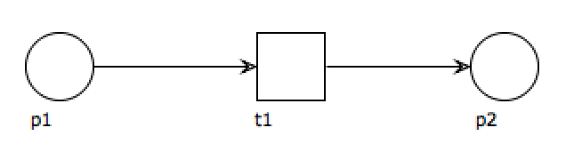
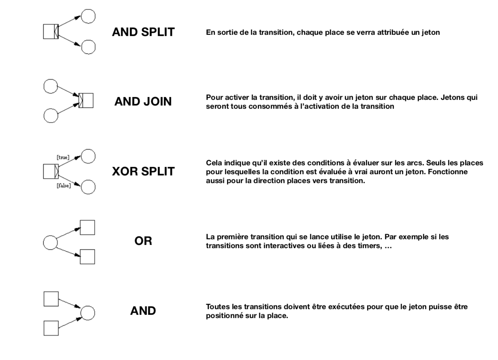

# Workflow - Pile

Nous utiliserons ici à la base la technique des Petri Net [PNML](https://en.wikipedia.org/wiki/Petri_net).
Tony Marston en a fait une approche workflow de laquelle s'inspire le développement actuel : [lien vers le site](https://www.tonymarston.net/php-mysql/workflow.html)

## La définition d'un workflow

Le workflow ici est basé sur le principe de places (ronds), transitions (carrés) et arcs reliant les deux.
* Une place est un emplacement. On imagine un jeton qui va circuler de place en place afin de progresser dans le workflow.
* Une transition est un passage pour faire progresser le jeton. Celà peut être une fonction, une attente d'une action dun utilisateur, ...
* Un arc va donc permettre d'indiquer :
    * Quels actions sont possibles depuis une place
    * Sur quelle(s) place(s) on arrive suite à une transition
    * Une condition peut-être ajoutée.

### Un workflow très minimal



* p1 est une place de démarrage
* t1 est une transition (fonction à exécuter par exemple)
* p2 est une place de fin

Nous avons ici une description d'un workflow. Mais comment celà fonctionne-t-il en pratique ?

#### Démarrage

En fait c'est un événement qui va déclencher une instance du workflow, appelé cas. Plus précisément, chaque place de démarrage est associé à un événement spécifique, donc si ce dernier se déclenche, le cas est démarraré pour l'objet ayant déclenché cet événement.

Pour simplifier, au démarrage, la place de départ se voit attribuer un jeton "libre". Il reste ensuite à laisser le cas vivre en fonction de sa logique. Lorsque le jeton atteint une place de fin le cas est terminé.

#### Progresser

Comment avancer dans un cas ?

C'est également très simple. Il suffit de regarder les jetons libres et vérifier si il existe des transitions que l'on peut exécuter. Exécuter une transition consomme le ou les jetons des places nécessaires. A la fin de l'exécution les places de sorties se voient attribuer des jetons "libres". On boucle ainsi pour faire avancer le cas.

A noter que les arcs pourront avoir des conditions. (assez basiques mais qui peuvent influer sur le chemin à prendre)

Certaines transitions pourront être manuelles, différée, ...

Un petit schéma des cas possibles :



#### Terminer

Lorsqu'une place de fin est atteinte, le cas est considéré comme fini. Sinon en cas d'erreur le cas s'arrête également.

## Schéma d'un workflow

### Le Workflow

Le workflow, sa description :

| Champ         | Type        | Description                        |
| ------------- | ----------- | ---------------------------------- |
| wf_id         | entier long | Identifiant du workflow            |
| ctx_id        | entier long | Identifiant du contexte            |
| thm_id        | entier long | Identifiant du thème               |
| wf_name       | chaine      | Nom du workflow                    |
| wf_desc       | chaine      | Description du workflow            |
| wf_fields     | chaine      | La liste des champs au format json |
| wf_valid      | boolean     | Workflow valide ?                  |
| wf_start_time | Date heure  | Début de validité du workflow      |
| wf_end_time   | Date heure  | Fin de validité du workflow        |
| wf_width      | entier long | Largeur                            |
| wf_height     | entier long | Hauteur                            |
| wf_app_code   | chaine      | Code de l'application              |
| wf_app_sys    | entier      | Application système                |
|               |             |                                    |

Seuls les workflows valides et avec des dates correctes pourront être utilisés. Le côté actif permet de temporaiement bloquer un workflow. Les dates servent à définir une plage d'utilisation. En effet il est très compliqué de modifier un workflow, nous opterons donc pour un nouveau workflow (permet de garder les anciens cas) tout en désactivant l'ancien.

**Tous les noms des éléments seront renommés avec .&lt;id&gt; en fin**

La description sera affichée à l'utilisateur pour qu'il ai une idée précise de ce qui est en cours, en plus de la transition attendue, ...

Le contexte et le thème sont deux liens vers des éléments qui permettent de regrouper et organiser les différents enregistrements. On verra leur description plus bas dans ce document.

### Les places

Les différents emplacements du workflow. Pour ceux de démarrage, ils sont associés à des évenements de déclenchement.

| Champ    | Type        | Description                     |
| -------- | ----------- | ------------------------------- |
| pcl_id   | entier long | Identifiant de la place         |
| wf_id    | entier long | Identifiant du workflow         |
| plc_name | chaine      | Nom du workflow                 |
| plc_desc | chaine      | Description de la place         |
| plc_type | chaine      | Type : START, END, INTERMEDIATE |
| plc_x    | entier long | Position en x                   |
| plc_y    | entier long | Position en y                   |
| eve_id   | entier long | Evénement associé (START)       |
|          |             |                                 |

Il est conseillé de préfixer le nom de la place par celui du workflow pour éviter les doublons. Les coordonnées permettent de positionner l'objet dans un "dessin"

### Les souscriptions (transitions)

Une souscription ou transition est en fait une attente d'un "événement" ou "déclencheur", lorsque cet évenement se produit la transaction peut être déclenchée, à moins qu'elle ne dépende de plusieurs places, règles, ...

| Champ              | Type        | Description                                        |
| ------------------ | ----------- | -------------------------------------------------- |
| sub_id             | entier long | Identifiant de la souscription                     |
| eve_id             | entier long | Identifiant de l'événement                         |
| fct_id             | entier long | Identifiant de la fonctionnalité                   |
| ctx_id             | entier long | Identifiant du contexte de souscription            |
| thm_id             | entier long | Identifiant du thème                               |
| sub_name           | chaine      | Nom de la souscription                             |
| sub_callback_type  | chaine      | FCT, WS, EVAL, CLASS                               |
| sub_callback_data  | chaine      | Données de lancement liées au type                 |
| sub_object_id      | chaine      | Identifiant spécifique pour la souscription        |
| user_id            | entier long | Identifiant de l'utilisateur                       |
| sub_mode           | chaine      | UNIQ, UNLIMITED                                    |
| sub_cron           | chaine      | Format crontab                                     |
| sub_status         | chaine      | CLOSED, PROGRESS, STOPPED, WAITING                 |
| sub_fields         | texte       | Données rattachées en json                         |
| sub_default_runner | chaine      | DIRECT, BACKGROUND, DELAYED, INTERACTIV, CRON, ... |
| sub_max_iteration  | entier      | Nombre maximum d'itération                         |
| sub_last_run       | date heure  | Date de dernier lancement                          |
| sub_min_vers       | chaine      | Version minimale si besoin                         |
| sub_max_vers       | chaine      | Version maximale si besoin                         |
| sub_exclusiv       | booléen     | Lancement exclusif ?                               |
| wf_id              | entier long | Identifiant du workflow                            |
| sub_in_type        | chaine      | Type de gestion des arcs en entrée                 |
| sub_out_type       | chaine      | Type de gestion des arcs en sortie                 |
| sub_x              | entier      | Position en x                                      |
| sub_y              | entier      | Position en y                                      |
|                    |             |                                                    |

### Les arcs

Les arcs sont indispensables car ils permettent de lier les places et transitions.

| Champ         | Type        | Description                                          |
| ------------- | ----------- | ---------------------------------------------------- |
| arc_id        | entier long | Identifiant de l'arc                                 |
| wf_id         | entier long | Identifiant du workflow                              |
| sub_id        | entier long | identifiant de la souscription                       |
| plc_id        | entier long | Identifiant de la place                              |
| arc_direction | chaine      | Direction IN / OUT (/ souscription)                  |
| arc_plc_pos   | chaine      | Position de l'arc pour la place                      |
| arc_sub_pos   | chaine      | Position de l'arc pour la souscription               |
| arc_eval      | chaine      | Condition simple pour suivre l'arc                   |
| arc_coords    | chaine      | Chaines de la liste des coordonnées pour l'affichage |
|               |             |                                                      |

Le champ "arc_eval" est basé sur une syntaxe basique pour évaluer si l'arc peut être empreinté. On peut utiliser des champs qui auront été passés lors de l'instanciation du cas ou ajoutés lors de l'exécution de souscriptions.

## Schéma d'un cas d'un workflow

Le cas d'un workflow va se compléter au fur et à mesure de son avancement.

### Le cas

Le cas est la vue du workflow, il est le point de liaison des différents jetons, ...

| Champ          | Type        | Description                                     |
| -------------- | ----------- | ----------------------------------------------- |
| cas_id         | entier long | Identifiant du cas                              |
| wf_id          | entier long | Identifiant du workflow                         |
| cas_object_id  | chaine      | Identifiant de l'objet &lt;id&gt;@&lt;thème&gt; |
| cas_start_time | date heure  | Date heure de démarrage                         |
| cas_end_time   | date heure  | Date heure de fin                               |
| cas_status     | chaine      | Status : PROGRESS, CLOSED, ERROR :              |
| cas_object     | chaine      | Sérialisation de l'objet complet en json        |
|                |             |                                                 |

### Le token

Le token est la représentation d'un jeton sur une place. Il est par défaut libre et passe à "consommé"" dès que la place est libérée.

| Champ         | Type        | Description                                     |
| ------------- | ----------- | ----------------------------------------------- |
| tok_id        | entier long | Identifiant du token                            |
| wf_id         | entier long | Identifiant du workflow                         |
| cas_id        | entier long | Identifiant du cas                              |
| plc_id        | entier long | Identifiant de la place                         |
| tok_object_id | chaine      | Identifiant de l'objet &lt;id&gt;@&lt;thème&gt; |
| tok_ts        | date heure  | Date heure de la dernière modification          |
| tok_status    | chaine      | Status : FREE, TAKEN                            |
|               |             |                                                 |

### La publication

La publication est le traitement en attente généré à partir d'une souscription. Dès que les conditions sont réunies pour déclencher une souscription (on regarde les jetons libres) on peut générer une publication.

| Champ             | Type        | Description                                  |
| ----------------- | ----------- | -------------------------------------------- |
| pub_id            | entier long | Identifiant de la souscription               |
| wf_id             | entier long | Identifiant du workflow                      |
| cas_id            | entier long | Identifiant du cas                           |
| sub_id            | entier long | Identifiant de la souscription               |
| eve_id            | entier long | Identifiant de l'événement                   |
| fct_id            | entier long | Identifiant de la fonctionnalité             |
| pub_ts            | date heure  | Date de lancement                            |
| pub_report        | texte       | Rapport                                      |
| pub_fields        | texte       | Données au format json                       |
| pub_status        | chaine      | OK, ERROR, NONE, RUNNING, WAITING, PAUSE     |
| user_id           | entier long | Identifiant de l'utilisateur                 |
| pub_runner        | chaine      | DIRECT, BACKGROUND, DELAYED, INTERACTIV, ... |
| pub_object_id     | chaine      | Identifiant spécifique pour la souscription  |
| pub_start_at      | date heure  | Heure de démarrage attendue                  |
| pub_start_time    | date heure  | Heure de démarrage                           |
| pub_end_time      | date heure  | Heure de fin                                 |
| pub_pid           | chaine      | Identifiant du processus                     |
| pub_history       | texte       | Historique                                   |
| pub_progress      | texte       | texte de progression                         |
| pub_return        | chaine      | Code de retour                               |
| pub_iteration     | entier      | Itération en cours                           |
| pub_max_iteration | entier      | Nombre maximum d'itération                   |
| pub_max_min       | entier      | Durée de vie de la publication : en minutes  |
|                   |             |                                              |

#### Rappel sub_cron basé sur les crontab :

```
mm hh jj MMM JJJ
```

* mm représente les minutes (de 0 à 59)
* hh représente l'heure (de 0 à 23)
* jj représente le numéro du jour du mois (de 1 à 31)
* MMM représente l'abréviation du nom du mois (jan, feb, ...) ou bien le numéro du mois (de 1 à 12)
* JJJ représente l'abréviation du nom du jour ou bien le numéro du jour dans la semaine :
    * 0 = Dimanche
    * 1 = Lundi
    * 2 = Mardi
    * ...
    * 6 = Samedi
    * 7 = Dimanche (représenté deux fois pour les deux types de semaine)

Pour chaque valeur numérique (mm, hh, jj, MMM, JJJ) les notations possibles sont :

* \* : à chaque unité (0, 1, 2, 3, 4...)
* 5,8 : les unités 5 et 8
* 2-5 : les unités de 2 à 5 (2, 3, 4, 5)
* \*/3 : toutes les 3 unités (0, 3, 6, 9...) : phase 2
* 10-20/3 : toutes les 3 unités, entre la dixième et la vingtième (10, 13, 16, 19) : phase 2

Exemples :

| Raccourcis | Description         | Équivalent |
| ---------- | ------------------- | ---------- |
| @reboot    | Au démarrage        | Aucun      |
| @yearly    | Tous les ans        | 0 0 1 1 *  |
| @monthly   | Tous les mois       | 0 0 1 * *  |
| @weekly    | Toutes les semaines | 0 0 * * 0  |
| @daily     | Tous les jours      | 0 0 * * *  |
| @midnight  | Toutes les nuits    | 0 0 * * *  |
| @hourly    | Toutes les heures   | 0 * * * *  |

## Autres tables

### Contexte

| Champ        | Type        | Description                       |
| ------------ | ----------- | --------------------------------- |
| ctx_id       | entier long | Identifiant du Contexte           |
| ctx_name     | chaine      | Nom du contexte, ex : OmegaGRC    |
| ctx_type     | énumération | APPL, FCT, WS, CLASS              |
| ctx_app_code | chaine      | Code de l'application, ex : OMEGA |
| ctx_app_sys  | booléen     | Contexte système ou application   |
| ctx_version  | chaine      | Version des données               |
|              |             |                                   |

Les champs, type, fct, ... servent simplement à la description du contexte et à son mode de fonctionnement global.

### Organisation

Afin de se simplifier certaines restrictions, sélection, ... nous allons ajouter une notion de thématique.

| Champ    | Type        | Description          |
| -------- | ----------- | -------------------- |
| thm_id   | entier long | Identifiant du thème |
| thm_name | chaine      | Nom du thème         |
| thm_desc | chaine      | Description du thème |
|          |             |                      |

### Evénement

| Champ             | Type        | Description                        |
| ----------------- | ----------- | ---------------------------------- |
| eve_id            | entier long | Identifiant de l'événement         |
| ctx_id            | entier long | Identifiant du contexte            |
| eve_name          | chaine      | Le code de l'événement             |
| eve_desc          | texte       | Descriptif long                    |
| eve_callback_type | énumération | FCT, WS, EVAL, CLASS, ...          |
| eve_callback_data | chaine      | Données de lancement liées au type |
| eve_app_code      | chaine      | Code de l'application              |
| eve_app_sys       | booléen     | Evénement système ou application   |
| thm_id            | entier long | Identifiant du thème               |
|                   |             |                                    |

### Fonctionnalités

| Champ        | Type        | Description                     |
| ------------ | ----------- | ------------------------------- |
| fct_id       | entier long | Identifiant de la fonction      |
| ctx_id       | entier long | Identifiant du contexte         |
| thm_id       | entier long | Identifiant du thème            |
| fct_name     | chaine      | Nom de la fonction              |
| fct_desc     | chaine      | Description de la fonction      |
| fct_fields   | chaine      | Liste des champs au format json |
| fct_type     | chaine      | Type de la fonction             |
| fct_data     | chaine      | Données liées à l'appel         |
| fct_app_code | chaine      | Code application                |
| fct_app_sys  | booléen     | Fonction système ou application |
|              |             |                                 |

Les champs callback servent à appeler en direct une action, ...

#### Modèle fct (exemple WinDev)

En renvoyant Vrai l'appelant passe la publication en OK, dans le cas contraire la passe en erreur, donc pas besoin de gérer cela dans la fonction.

```
PROCEDURE GLOBALE wait100(LOCAL p_pub est un OMEGAQueueModelPublication)

LOCAL
  bRetour est un booléen = Vrai

p_pub.setPubProgress("...")
p_pub.update(Vrai, ["PUB_PROGRESS"])
multitache(1000)
p_pub.setPubProgress("Fini")
p_pub.update(Vrai, ["PUB_PROGRESS"])

RENVOYER bRetour

```

## Exemples

* [Exemple 1](sample1.md)

## Divers

### Autres liens utiles

L'affichage est réalisé à l'aide d'un autre outil [joint.js](http://www.jointjs.com/) et d'un plugin destiné aux petri-nets.

[Voici](http://woped.dhbw-karlsruhe.de/woped/) un outil pour créer des workflow sous petri-nets.<br>
